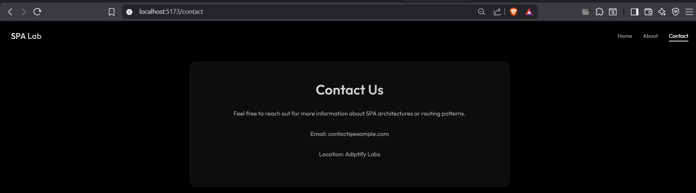

# Exp-3 Section-1: Basic SPA Routing

A project focusing on interactive web elements, including dynamic lists, input handling, and modern CSS layouts.

## Key Features
- Dynamic list management (Add/Remove items).
- Real-time search and filtering.
- Responsive layout using Vite and React.

## Screenshots

## Tech Stack
- React 19
- Vite
- CSS Flexbox/Grid

---
Developed by **Kumar Aditya**
