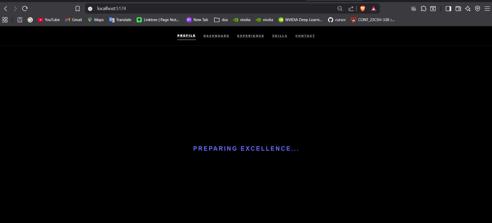
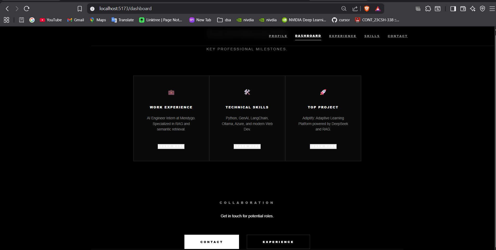
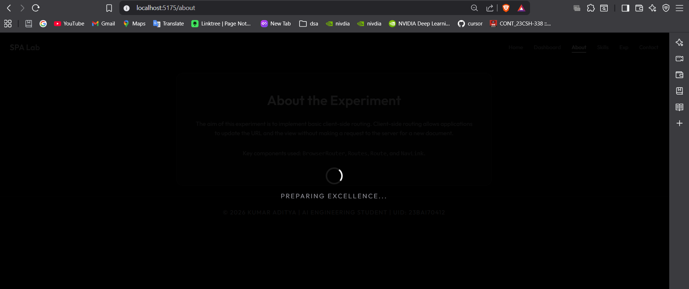

# Exp-5
Lazy Loading 

Lazy loading is the performance optimization techinque where components load when they are reuired 
in react React.lazy and React.suspense are the two things that are required to perform Lazy Loading 
React.Lazy allows components to load dynamically 
React.Suspense allows to show a fallback UI while the component is loading due lazy loading 
Benefits 
1. Provides an optimization Technique to inc the performance of the website 
2. Improves the Page Load time 
3. Reduces the Memory Usage 
## Section-1
Implementting in the Dashbaord with a loading time of 3 sec 
## Screenshots
   
   
   

## Section-2
Implementting in the Dashbaord with a loading time of 2 sec in each and every page 
## Screenshots
   
   
 
   
   
     
---
Developed by **Kumar Aditya**
