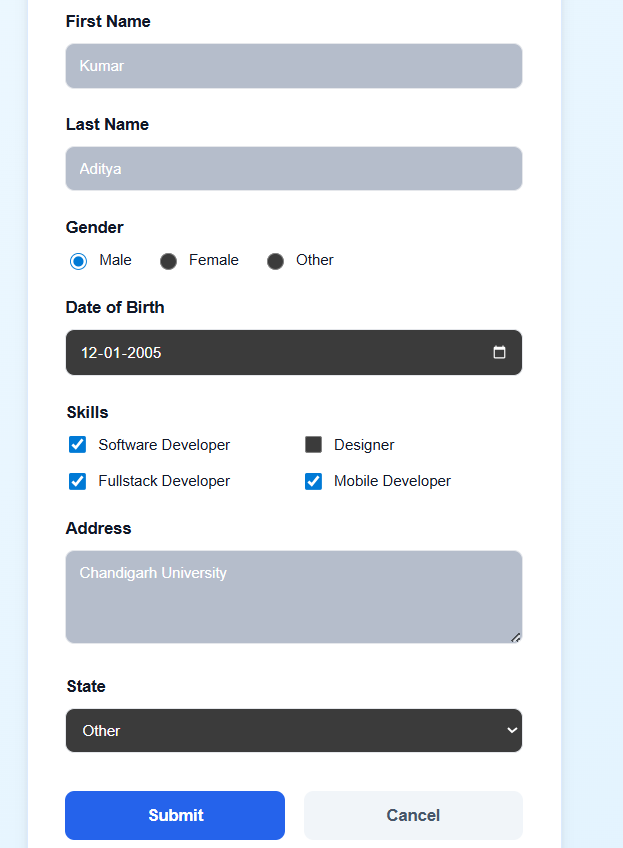
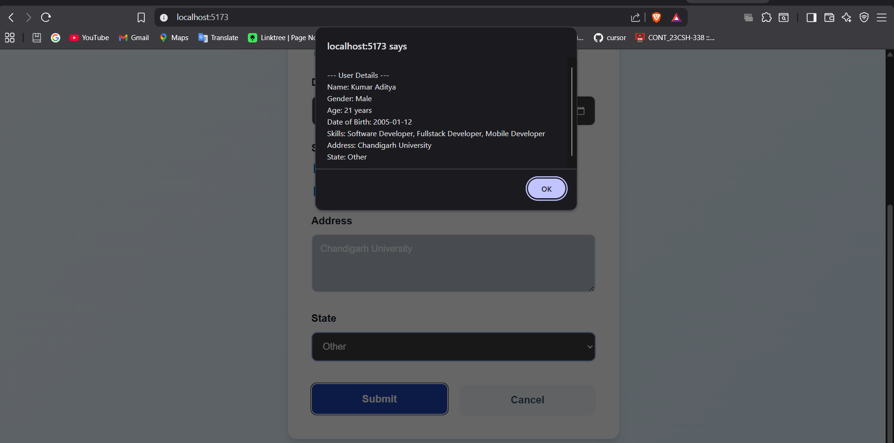
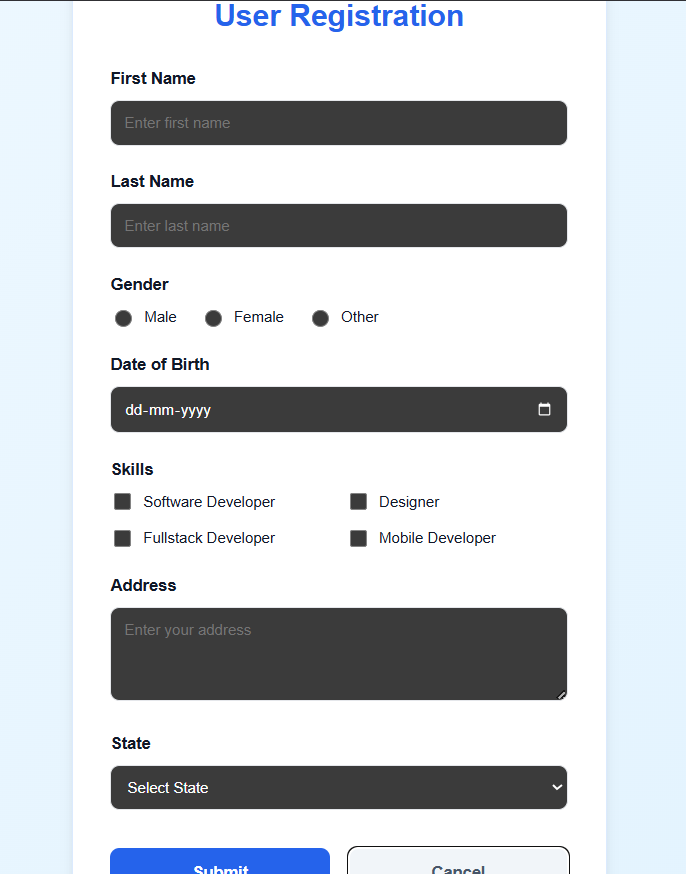
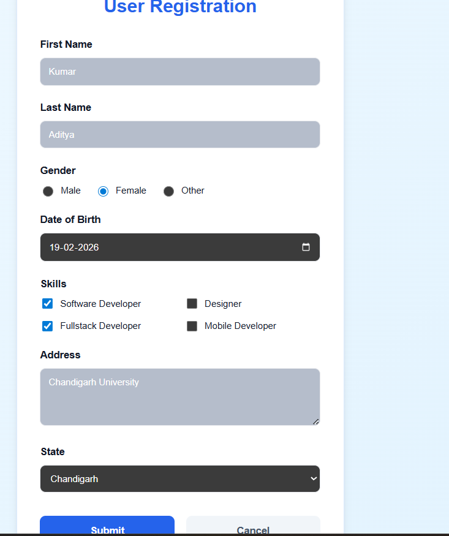

# Exp-6 Section-1: User Registration Form

A project focusing on Proper implementation fo User Registration Form.

## Key Features
- User Registration Form with proper validation.
- Responsive layout using Vite and React.
- Age Calculation.
- Selected Skills Display.
- Form Reset.

## Screenshots

## Tech Stack
- React 19
- Vite
- CSS Flexbox/Grid

---
Developed by **Kumar Aditya**
