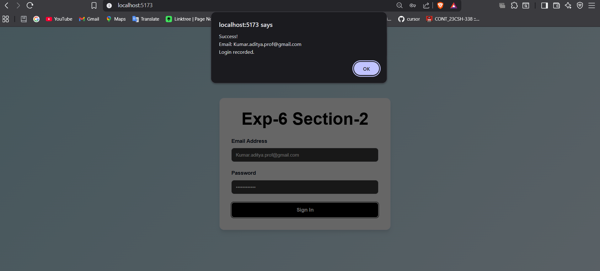
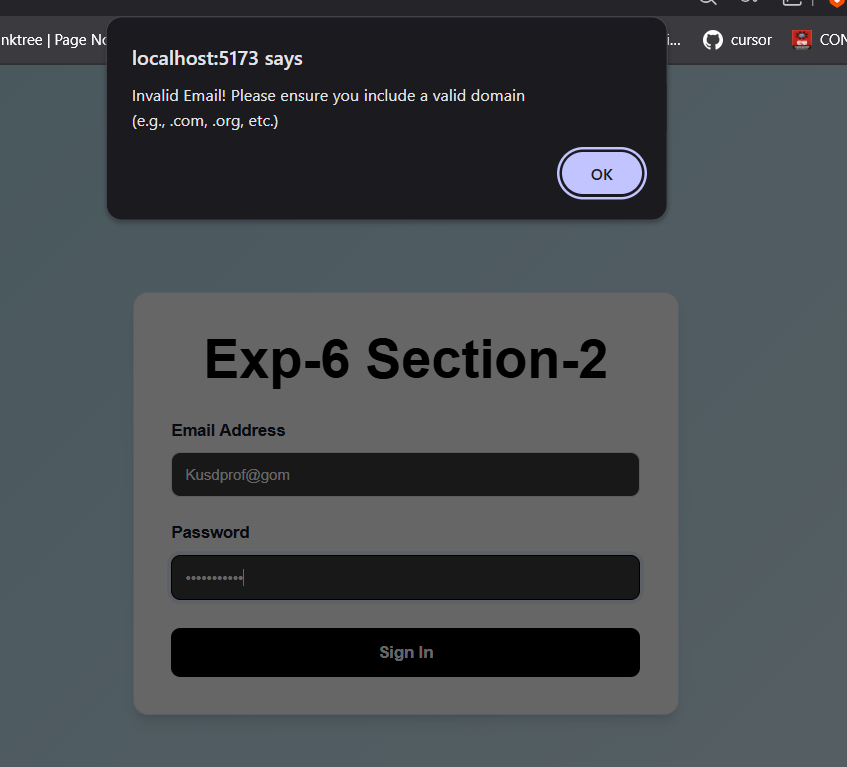
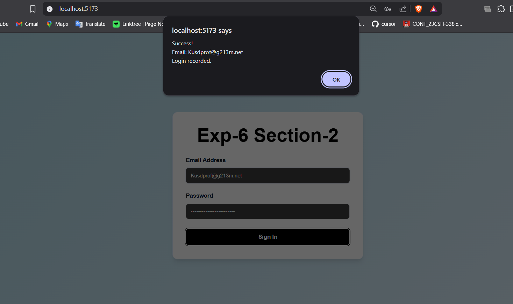

# Exp-6 Section-2: Form Validation

A project focusing on Proper implementation fo Email and Password validation.

## Key Features
- Email validation (Strict regex for domain).
- Password validation (Starts with Uppercase, includes lowercase, special char, number, length >= 8).
- Responsive layout using Vite and React.

## Screenshots

## Tech Stack
- React 19
- Vite
- CSS Flexbox/Grid

---
Developed by **Kumar Aditya**
